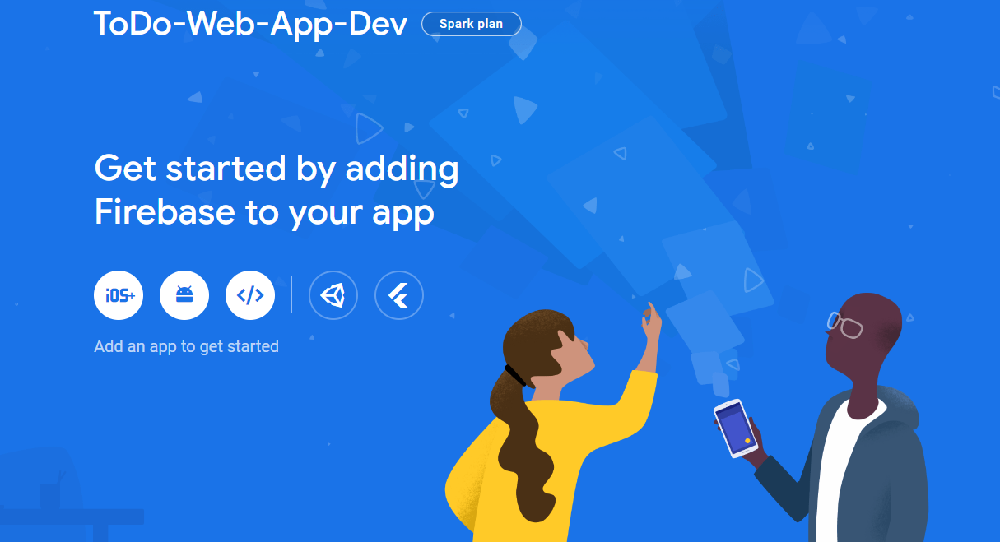

# Project setup

## - FireBase setup

### We will create a firebase environment

- <mark> **Main Setup Overview** </mark>

1) Login to <a href="https://firebase.google.com/" target="_blank">Firebase</a>
2) Create a new Firebase project
3) Give the project a name.<br>
&ensp;The name I chose for the environment is as follows <br>
&ensp;( ToDo-Web-App)
4) Go to Build --> Authentication --> Get started
5) choose sign-in method --> sign-in providers and enable the *Email/Password* option
6) Go to Build --> Firestore Database --> Create database --> Choose a location
7) Select **Start in production mode** and then press **Enable**
8) Go to the **Rules** tab and then change **if false** to **is true** and then press **Publish** as shown in the image bellow


- <mark> **Firebase SDK Setup (API Keys)** </mark>

1) Navigate to Project Overview --> add a Web App using the (</>) icon as shown in the image below<br>
2) Register the app --> Give it a name ( skip *Firebase Hosting*)
3) Firebase SDK --> Copy the initialization values from the `const firebaseConfig` variable and paste them into the **.evn.local** file inside the project



## - React App setup

- First we need to open the CMD and navigate to the project folder and then to type these 2 commands

```cmd
npx create-react-app todo-web-app
cd todo-web-app
```

- Replace the folders inside **(todo-web-app)** with the ones inside the github repo
- Navigate to **(todo-web-app)** and install the following libraries using the command prompt:

```cmd
npm i firebase
npm i react-bootstrap bootstrap 
npm i react-router-dom
npm install @mui/icons-material
npm install @emotion/styled
npm install @emotion/react
```

- Local environment setup *( .env.local )* :<br>

Place the Firbase Configuration keys from your firebase development project following the naming convention for environemtns in React
>`REACT_APP_[VARIABLE_NAME]`= KEY_VALUE

----------------------------------------------
## Available Scripts

In the project directory, you can run:

### `npm start`

Runs the app in the development mode.\
Open [http://localhost:3000](http://localhost:3000) to view it in your browser.

The page will reload when you make changes.\
You may also see any lint errors in the console.

### `npm test`

Launches the test runner in the interactive watch mode.\
See the section about [running tests](https://facebook.github.io/create-react-app/docs/running-tests) for more information.

### `npm run build`

Builds the app for production to the `build` folder.\
It correctly bundles React in production mode and optimizes the build for the best performance.

The build is minified and the filenames include the hashes.\
Your app is ready to be deployed!

See the section about [deployment](https://facebook.github.io/create-react-app/docs/deployment) for more information.

### `npm run eject`

**Note: this is a one-way operation. Once you `eject`, you can't go back!**

If you aren't satisfied with the build tool and configuration choices, you can `eject` at any time. This command will remove the single build dependency from your project.

Instead, it will copy all the configuration files and the transitive dependencies (webpack, Babel, ESLint, etc) right into your project so you have full control over them. All of the commands except `eject` will still work, but they will point to the copied scripts so you can tweak them. At this point you're on your own.

You don't have to ever use `eject`. The curated feature set is suitable for small and middle deployments, and you shouldn't feel obligated to use this feature. However we understand that this tool wouldn't be useful if you couldn't customize it when you are ready for it.

## Learn More

You can learn more in the [Create React App documentation](https://facebook.github.io/create-react-app/docs/getting-started).

To learn React, check out the [React documentation](https://reactjs.org/).

### Code Splitting

This section has moved here: [https://facebook.github.io/create-react-app/docs/code-splitting](https://facebook.github.io/create-react-app/docs/code-splitting)

### Analyzing the Bundle Size

This section has moved here: [https://facebook.github.io/create-react-app/docs/analyzing-the-bundle-size](https://facebook.github.io/create-react-app/docs/analyzing-the-bundle-size)

### Making a Progressive Web App

This section has moved here: [https://facebook.github.io/create-react-app/docs/making-a-progressive-web-app](https://facebook.github.io/create-react-app/docs/making-a-progressive-web-app)

### Advanced Configuration

This section has moved here: [https://facebook.github.io/create-react-app/docs/advanced-configuration](https://facebook.github.io/create-react-app/docs/advanced-configuration)

### Deployment

This section has moved here: [https://facebook.github.io/create-react-app/docs/deployment](https://facebook.github.io/create-react-app/docs/deployment)

### `npm run build` fails to minify

This section has moved here: [https://facebook.github.io/create-react-app/docs/troubleshooting#npm-run-build-fails-to-minify](https://facebook.github.io/create-react-app/docs/troubleshooting#npm-run-build-fails-to-minify)

